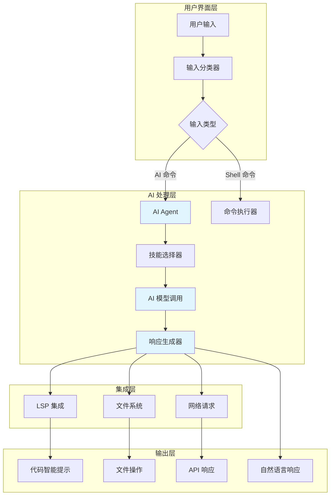
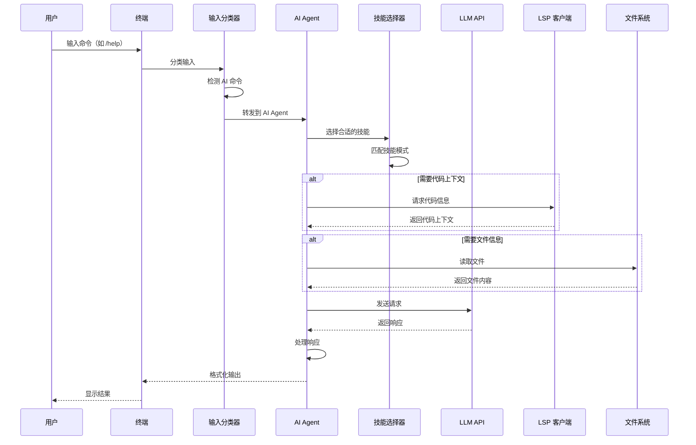

[根目录](../../CLAUDE.md) > **app/ai**

# AI 模块

> 最后更新：2026年 5月 1日

## 模块职责

AI 模块负责 Warp 中的所有 AI 集成功能，包括：

- **Agent Mode**：内置的 AI 编码助手
- **Agent SDK**：用于构建和集成自定义 AI agents 的框架
- **对话管理**：管理 AI 对话历史和状态
- **AI 索引**：代码库索引和上下文感知
- **技能系统**：可扩展的 AI 技能框架
- **Cloud AI**：与云端 AI 服务的集成

## 架构和流程

### AI 请求流程

完整的 AI 请求流程架构图和序列图请参考：[`.claude/architecture-diagrams.md`](../../.claude/architecture-diagrams.md#1-ai-请求流程)

**流程概览**：
1. 用户输入通过输入分类器识别为 AI 命令
2. AI Agent 选择合适的技能
3. 如需代码上下文，通过 LSP 获取
4. 如需文件信息，通过文件系统读取
5. 调用 LLM API 获取响应
6. 处理并格式化输出给用户

### 架构图



### 序列图



## 入口与启动

### 主要入口点

- `app/src/ai/mod.rs` - AI 模块主入口
- `app/src/ai/agent/` - Agent Mode 实现
- `app/src/ai/agent_sdk/` - Agent SDK
- `app/src/ai/agent_management/` - Agent 管理 UI

### 初始化流程

1. AI 系统在应用启动时初始化
2. 加载 AI 配置和 API keys
3. 初始化 Agent SDK 和技能系统
4. 启动后台索引服务

## 对外接口

### Agent Mode API

**主要类型**：
- `Conversation` - AI 对话表示
- `Task` - AI 任务和请求
- `Agent` - Agent 配置和状态
- `Artifact` - AI 生成的工件

**关键函数**：
```rust
// 创建新对话
Conversation::new()

// 执行 AI 任务
Task::execute()

// 管理 agents
AgentManagementModel::list_agents()
AgentManagementModel::create_agent()
```

### Agent SDK

**核心组件**：
- `Driver` - Agent 执行驱动
- `Harness` - Agent 适配器（Claude Code, Codex, Gemini 等）
- `Environment` - Agent 环境变量
- `Attachments` - 文件附件处理

**支持的 Harness**：
- Claude Code
- Codex
- Gemini CLI
- 自定义 agents

## 关键依赖与配置

### 依赖

- `crates/ai/` - 核心 AI 功能
- `crates/warp_js/` - JavaScript 运行时（用于某些 agents）
- `crates/lsp/` - LSP 支持（用于代码上下文）
- `app/src/persistence/` - 对话持久化

### 配置文件

- AI agents 配置：`~/.warp/agents/`
- API keys：通过设置管理
- 技能定义：`resources/bundled/skills/`

### 环境变量

- `OPENAI_API_KEY` - OpenAI API key
- `ANTHROPIC_API_KEY` - Anthropic API key
- `WARP_AI_ENABLED` - 启用/禁用 AI 功能

## 数据模型

### Conversation（对话）

```rust
pub struct Conversation {
    pub id: ConversationId,
    pub messages: Vec<Message>,
    pub status: ConversationStatus,
    pub artifacts: Vec<Artifact>,
}
```

### Task（任务）

```rust
pub struct Task {
    pub id: TaskId,
    pub conversation_id: ConversationId,
    pub prompt: String,
    pub context: TaskContext,
    pub status: TaskStatus,
}
```

### Agent（代理）

```rust
pub struct Agent {
    pub id: AgentId,
    pub name: String,
    pub harness: HarnessType,
    pub config: AgentConfig,
    pub capabilities: Vec<Capability>,
}
```

## 测试与质量

### 单元测试

测试文件位置：
- `app/src/ai/*/*_tests.rs`
- `app/src/ai/*/mod_test.rs`

运行测试：
```bash
cargo nextest run -p warp -- ai
```

### 集成测试

Agent Mode 的集成测试位于：
- `crates/integration/tests/ai/`
- `crates/integration/tests/agent_mode/`

### 测试覆盖

当前测试覆盖：
- ✅ 对话管理
- ✅ 任务执行
- ✅ Agent SDK 基本功能
- ⚠️ 复杂 AI 工作流
- ⚠️ 多轮对话
- ⚠️ 错误处理

## 常见问题 (FAQ)

### Q: 如何添加新的 AI harness？

A: 在 `app/src/ai/agent_sdk/driver/harness/` 中创建新的 harness 实现，并实现 `Harness` trait。

### Q: Agent Mode 的数据存储在哪里？

A: 对话数据存储在本地 SQLite 数据库中，通过 `persistence` 模块管理。

### Q: 如何调试 Agent Mode？

A:
1. 启用 `agent_mode_debug` 特性标志
2. 查看日志输出
3. 使用 Agent Management UI 查看状态

### Q: AI 索引如何工作？

A: 代码库索引在 `crates/ai/src/index/` 中实现，使用嵌入和 Merkle 树进行增量更新。

## 相关文件清单

### 核心文件

- `app/src/ai/mod.rs` - 模块入口
- `app/src/ai/agent/mod.rs` - Agent Mode
- `app/src/ai/agent_sdk/` - Agent SDK
- `app/src/ai/agent_management/` - Agent 管理
- `app/src/ai/agent_conversations_model.rs` - 对话模型
- `app/src/ai/active_agent_views_model.rs` - 视图模型

### 辅助文件

- `app/src/ai/agent_events/` - Agent 事件处理
- `app/src/ai/agent_sdk/driver/` - Agent 驱动
- `app/src/ai/agent_sdk/harness/` - Agent 适配器

### 测试文件

- `app/src/ai/*/*_tests.rs` - 单元测试
- `crates/integration/tests/ai/` - 集成测试

## 变更记录

### 2026-05-01

- 初始化 AI 模块文档
- 记录核心架构和接口
- 添加测试覆盖信息
