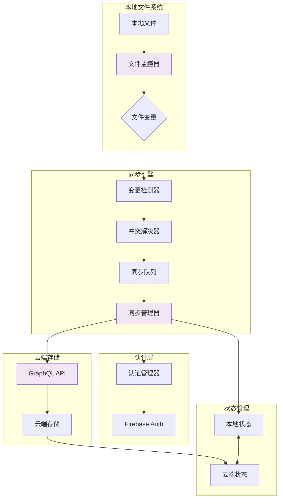
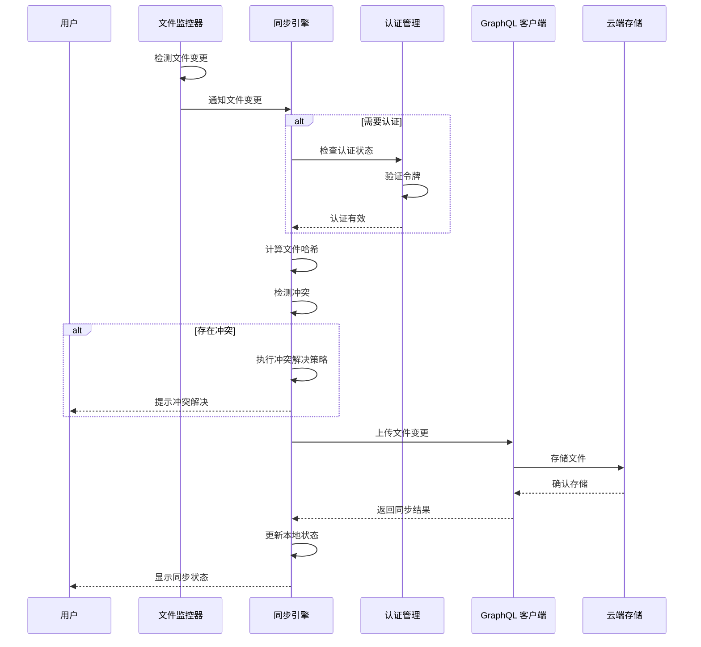

[根目录](../../../CLAUDE.md) > **app/src/drive**

# Drive 模块

> 最后更新：2026年 5月 1日

## 模块职责

Drive 模块（`app/src/drive/`）提供 Warp 的云同步功能，允许用户跨设备同步设置、工作流、环境变量集合、笔记本等数据。通过 Warp Drive，用户可以在不同机器间保持一致的开发环境。

**核心功能**：
- 对象同步（笔记本、工作流、环境变量）
- 匿名用户限制管理
- 与 Firebase 的集成
- 云对象持久化
- 认证集成

## 架构和流程

### 文件同步流程

完整的文件同步流程架构图和序列图请参考：[`.claude/architecture-diagrams.md`](../../.claude/architecture-diagrams.md#3-文件同步流程)

**流程概览**：
1. 文件监控器检测本地文件变更
2. 同步引擎验证认证状态
3. 计算文件哈希并检测冲突
4. 通过 GraphQL API 上传到云端
5. 更新本地同步状态

### 架构图



### 序列图



## 入口与启动

### 主要入口点

- `drive_helpers.rs` - Drive 功能辅助函数
- 设置视图：`settings_view/warp_drive_page.rs` - Drive 设置页面

### 初始化流程

Drive 功能通过以下组件初始化：

1. **CloudModel** - 云对象模型：
   ```rust
   let cloud_model = CloudModel::handle(ctx);
   ```

2. **AuthStateProvider** - 认证状态提供者：
   ```rust
   let auth_state = AuthStateProvider::handle(ctx);
   ```

3. **AuthManager** - 认证管理器：
   ```rust
   let auth_manager = AuthManager::handle(ctx);
   ```

## 对外接口

### 核心函数

**匿名用户限制检查**：

```rust
// 检查匿名用户是否达到笔记本限制
pub fn has_feature_gated_anonymous_user_reached_notebook_limit<V>(
    ctx: &mut ViewContext<V>,
) -> bool;

// 检查匿名用户是否达到工作流限制
pub fn has_feature_gated_anonymous_user_reached_workflow_limit<V>(
    ctx: &mut ViewContext<V>,
) -> bool;

// 检查匿名用户是否达到环境变量集合限制
pub fn has_feature_gated_anonymous_user_reached_env_var_limit<V>(
    ctx: &mut ViewContext<V>,
) -> bool;
```

**工作流程**：
1. 读取当前对象计数（笔记本、工作流、环境变量）
2. 检查认证状态和限制
3. 如果达到限制，通知 `AuthManager`
4. 返回是否达到限制

### CloudModel 集成

```rust
impl CloudModel {
    // 读取云对象
    pub fn read<R, F: FnOnce(&CloudModel, &AppContext) -> R>(
        &self,
        ctx: &AppContext,
        f: F,
    ) -> R;

    // 更新云对象
    pub fn update<U, F: FnOnce(&mut CloudModel, &mut AppContext) -> U>(
        &self,
        ctx: &mut AppContext,
        f: F,
    ) -> U;
}
```

### AuthManager 集成

```rust
impl AuthManager {
    // 匿名用户达到对象限制时调用
    pub fn anonymous_user_hit_drive_object_limit(
        &mut self,
        ctx: &mut ViewContext<Self>,
    );
}
```

## 关键依赖与配置

### 依赖

- `warpui` - UI 框架
- `auth` - 认证模块（内部）
- `cloud_object` - 云对象模型（内部）
- `settings` - 设置管理（内部）

### 对象类型

```rust
pub enum ObjectType {
    Notebook,
    Workflow,
    GenericStringObject(GenericStringObjectFormat),
}

pub enum GenericStringObjectFormat {
    Json(JsonObjectType),
}

pub enum JsonObjectType {
    EnvVarCollection,
    // ...
}

pub enum Space {
    Personal,
    Team,
}
```

### 限制配置

匿名用户对每种对象类型有数量限制，通过 `AuthStateProvider` 配置：
```rust
pub fn is_anonymous_user_past_object_limit(
    &self,
    object_type: ObjectType,
    count: usize,
) -> Option<bool>;
```

## 数据模型

### 云对象

```rust
pub struct CloudModel {
    // 管理：
    // - 笔记本 (Notebook)
    // - 工作流 (Workflow)
    // - 环境变量集合 (EnvVarCollection)
    // - 其他云对象
}
```

### 计数方法

```rust
impl CloudModel {
    // 计算非欢迎笔记本数量
    pub fn active_non_welcome_notebooks_in_space(
        &self,
        space: Space,
        ctx: &AppContext,
    ) -> impl Iterator<Item = _>;

    // 计算非欢迎工作流数量
    pub fn active_non_welcome_workflows_in_space(
        &self,
        space: Space,
        ctx: &AppContext,
    ) -> impl Iterator<Item = _>;

    // 计算非欢迎环境变量集合数量
    pub fn active_non_welcome_env_var_collections_in_space(
        &self,
        space: Space,
        ctx: &AppContext,
    ) -> impl Iterator<Item = _>;
}
```

## 测试与质量

### 测试覆盖

- **单元测试**：有限（主要逻辑在其他模块）
- **集成测试**：通过 `crates/integration/` 进行
- **手动测试**：需要实际云同步验证

### 测试策略

- 测试匿名用户限制逻辑
- 测试对象计数准确性
- 测试认证状态集成
- 测试边界条件（达到限制、未达到限制）

### 已知问题

- 限制检查可能存在性能问题（需要遍历所有对象）
- 匿名用户升级到付费用户后，限制更新可能有延迟
- 对象删除后计数可能不同步

## 常见问题 (FAQ)

**Q: 如何修改匿名用户的对象限制？**
A: 限制配置在 `AuthStateProvider` 中，需要修改服务端配置或客户端逻辑。

**Q: 对象同步是实时的吗？**
A: 同步通过 `CloudModel` 和 Firebase 实现，通常是近实时的，但可能有延迟。

**Q: 如何处理同步冲突？**
A: 冲突解决逻辑在 `CloudModel` 中，通常使用最后写入获胜或合并策略。

**Q: 匿名用户如何升级？**
A: 通过 `AuthManager` 触发认证流程，用户登录后自动升级为付费用户。

**Q: 团队空间如何共享对象？**
A: 使用 `Space::Team` 而非 `Space::Personal`，需要相应的团队成员权限。

## 相关文件清单

### 核心文件

- `drive_helpers.rs` - Drive 功能辅助函数
  - 匿名用户限制检查
  - 对象计数
  - 认证集成

### UI 组件

- `settings_view/warp_drive_page.rs` - Drive 设置页面
  - 同步状态显示
  - 对象管理界面
  - 限制信息显示

### 入职引导

- `terminal/view/block_onboarding/onboarding_drive_sharing_block.rs` - Drive 共享入职引导块

### 依赖模块

- `auth/` - 认证模块
  - `auth_manager.rs` - 认证管理器
  - `auth_state.rs` - 认证状态
- `cloud_object/` - 云对象模型
  - `model/persistence/cloud_model.rs` - 云模型持久化

## 变更记录

### 2026-05-01

- ✅ 初始化 Drive 模块文档
- ✅ 记录匿名用户限制检查功能
- ✅ 记录云对象和认证集成
- ✅ 添加对象类型和空间说明

---

*本文档由 AI 自动生成和维护。如有问题或建议，请在 issue 中提出。*
