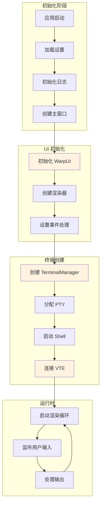
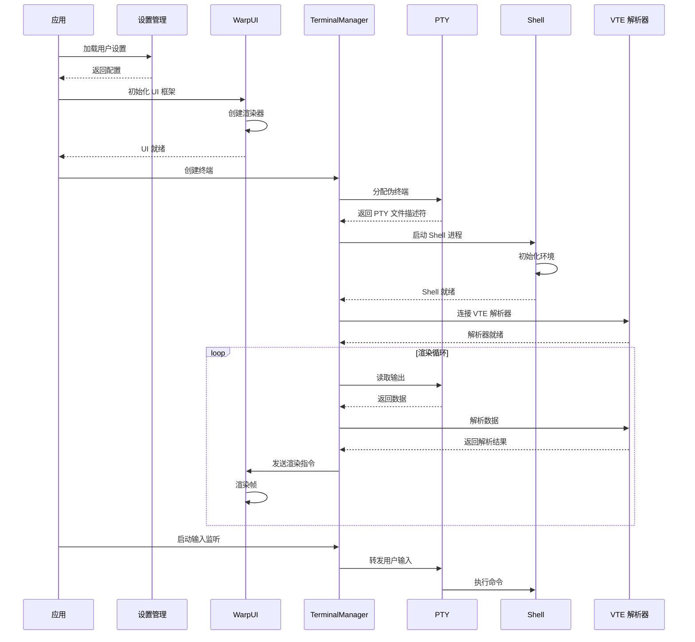

[根目录](../../../CLAUDE.md) > **app/src/terminal**

# Terminal 应用模块

> 最后更新：2026年 5月 1日

## 模块职责

Terminal 应用模块（`app/src/terminal/`）是 Warp 的终端应用层，负责终端 UI 的创建、管理和交互。它桥接底层的 `warp_terminal` 仿真器核心和 WarpUI 框架，提供完整的终端用户体验。

**核心功能**：
- 终端视图（`TerminalView`）和模型（`TerminalModel`）的创建与管理
- PTY（伪终端）和 TTY（终端设备）的集成
- 本地和远程终端会话管理
- 终端输入处理和事件分发
- 终端大小调整和字体度量
- 共享会话支持（多用户查看同一终端）

## 架构和流程

### 终端启动流程

完整的终端启动流程架构图和序列图请参考：[`.claude/architecture-diagrams.md`](../../.claude/architecture-diagrams.md#2-终端启动流程)

**流程概览**：
1. 应用启动并加载设置
2. 初始化 WarpUI 框架和渲染器
3. 创建 TerminalManager
4. 分配 PTY 并启动 Shell
5. 连接 VTE 解析器
6. 启动渲染循环处理输出

### 架构图



### 序列图



## 入口与启动

### 主要入口点

- `terminal_manager.rs` - `TerminalManager` trait 和实现
- `model/terminal_model.rs` - `TerminalModel` - 终端状态的核心模型
- `view/` - 终端 UI 组件和渲染
- `input/terminal.rs` - 终端输入处理
- `local_tty/terminal_manager.rs` - 本地 TTY 管理
- `remote_tty/terminal_manager.rs` - 远程 TTY 管理

### 初始化流程

1. **创建 TerminalModel**：
   ```rust
   let (terminal_model, initialize_task) = TerminalModel::new(
       size_info,
       terminal_settings,
       session_settings,
       task_handle,
       font_cache,
       appearance,
       ctx,
   );
   ```

2. **创建 TerminalView**：
   ```rust
   let terminal_view = TerminalView::new(
       terminal_model.clone(),
       initial_size,
       appearance,
       ctx,
   );
   ```

3. **启动 PTY**：
   - 使用 `TerminalManager` trait 管理进程生命周期
   - 本地终端通过 `local_tty/terminal_manager.rs` 启动 shell
   - 远程终端通过 `remote_tty/terminal_manager.rs` 连接

4. **建立事件循环**：
   - PTY 输出 → TerminalModel → TerminalView 渲染
   - 用户输入 → TerminalView → PTY 输入

## 对外接口

### TerminalManager Trait

```rust
pub trait TerminalManager: Any {
    fn model(&self) -> Arc<FairMutex<TerminalModel>>;
    fn view(&self) -> ViewHandle<TerminalView>;
    fn on_view_detached(&self, _detach_type: DetachType, _app: &mut AppContext) {}
    fn as_any(&self) -> &dyn Any;
    fn as_any_mut(&mut self) -> &mut dyn Any;
}
```

**实现**：
- `local_tty/terminal_manager.rs` - `LocalTerminalManager`
- `remote_tty/terminal_manager.rs` - `RemoteTerminalManager`
- `shared_session/viewer/terminal_manager.rs` - `SharedSessionViewerTerminalManager`

### TerminalModel

```rust
pub struct TerminalModel {
    // 终端状态的核心模型，包含：
    // - 终端网格内容
    // - 光标位置
    // - 模式（插入、替换等）
    // - 颜色和样式
}
```

**关键方法**：
- `new()` - 创建新模型
- `lock()` - 获取模型锁（⚠️ 谨慎使用，避免死锁）
- `update()` - 更新模型状态
- `read()` - 读取模型状态

### TerminalView

```rust
pub struct TerminalView {
    // 终端 UI 视图，负责：
    // - 渲染终端网格
    // - 处理用户输入
    // - 显示光标
    // - 管理滚动
}
```

**UI 元素**：
- `TerminalBlockElement` - 终端块渲染
- `TerminalSizeElement` - 终端大小调整
- `TerminalMessageBar` - 终端消息提示

### PTY/TTY 集成

**本地 TTY** (`local_tty/terminal_manager.rs`):
- 启动 shell 进程（zsh、bash、fish 等）
- 管理 PTY 文件描述符
- 处理进程退出和信号

**远程 TTY** (`remote_tty/terminal_manager.rs`):
- 连接到远程终端会话
- 处理网络通信
- 支持共享会话查看

## 关键依赖与配置

### 依赖

- `warp_terminal` - 终端仿真器核心（内部 crate）
- `warpui` - UI 框架（内部 crate）
- `parking_lot` - 高性能锁（`FairMutex`）
- `pathfinder_geometry` - 几何计算
- `settings` - 设置管理（内部 crate）

### 配置

**TerminalSettings** - 终端配置：
- 字体和颜色
- 滚动行为
- 光标样式
- 终端间距
- 最大网格大小

**SessionSettings** - 会话配置：
- 环境变量
- 工作目录
- Shell 类型

### 平台特定

- **macOS/Unix**: 使用 POSIX PTY
- **Windows**: 使用 ConPTY 或伪控制台
- **WASM**: 受限支持，主要用于查看

## 数据模型

### 核心数据结构

```rust
pub struct TerminalModel {
    // 终端网格（字符、颜色、样式）
    // 光标状态
    // 模式状态
    // 滚动历史
}

pub struct SizeInfo {
    pub cell_size: Vector2F,
    pub grid_size: Vector2F,
    pub font_size: f32,
    // ...
}

pub enum DetachType {
    Closed,      // 终端关闭，清理资源
    Moved,       // 终端移动，保留状态
    HiddenForClose, // 终端隐藏，保留状态
}
```

### 事件流

1. **PTY 输出** → `TerminalModel::update()` → 状态更新
2. **状态更新** → `TerminalView::render()` → UI 重绘
3. **用户输入** → `TerminalView::handle_input()` → PTY 输入

## 测试与质量

### 测试覆盖

- **单元测试**：部分（`terminal_model_test.rs`）
- **回归测试**：完善（`ref_tests/` 目录）
  - 使用 JSON 配置定义测试用例
  - 验证终端渲染的正确性
  - 测试各种转义序列和控制码

### 测试文件

- `model/terminal_model_test.rs` - 模型测试
- `ref_tests/` - 回归测试套件
- `test_util/terminal.rs` - 测试工具

### 已知问题

⚠️ **终端模型锁定**：
- 在 `TerminalModel` 上调用 `model.lock()` 时要极其小心
- 获取多个锁可能导致死锁
- 优先在调用堆栈中向下传递已锁定的模型引用
- 保持锁范围尽可能短

### 调试

- 使用 `DebugSettings` 启用调试输出
- 查看 `warp.pty.recording` 分析 PTY 通信
- 使用回归测试验证终端行为

## 常见问题 (FAQ)

**Q: 如何添加新的终端功能？**
A: 通常在 `TerminalModel` 中添加状态，在 `TerminalView` 中添加 UI，在 `TerminalManager` 中管理生命周期。

**Q: 终端渲染性能如何优化？**
A: 使用增量渲染，只更新变化的网格单元。避免频繁的 `model.lock()` 调用。

**Q: 如何支持新的 shell 或终端特性？**
A: 在 `local_tty/terminal_manager.rs` 中配置启动参数，确保 PTY 正确处理转义序列。

**Q: 共享会话如何工作？**
A: 通过 `shared_session/viewer/terminal_manager.rs`，多个客户端可以订阅同一个终端模型的状态更新。

**Q: WASM 平台支持哪些功能？**
A: WASM 主要用于查看终端，无法直接启动进程。需要与远程终端服务配合使用。

## 相关文件清单

### 核心管理

- `terminal_manager.rs` - `TerminalManager` trait 和工厂函数
- `model/terminal_model.rs` - `TerminalModel` 核心实现
- `model/terminal_model_test.rs` - 模型测试

### UI 组件

- `view/` - 终端视图组件
- `input/terminal.rs` - 终端输入处理
- `input/terminal_message_bar.rs` - 消息提示
- `terminal_size_element.rs` - 大小调整元素

### TTY 实现

- `local_tty/terminal_manager.rs` - 本地 TTY 管理
- `local_tty/terminal_attributes.rs` - TTY 属性配置
- `remote_tty/terminal_manager.rs` - 远程 TTY 管理
- `writeable_pty/terminal_manager_util.rs` - PTY 工具函数

### 共享会话

- `shared_session/viewer/terminal_manager.rs` - 共享会话查看器

### 回归测试

- `ref_tests/` - 终端回归测试
  - 包含 JSON 配置和预期输出
  - 测试各种终端场景

### 测试工具

- `test_util/terminal.rs` - 测试辅助函数

### 其他

- `session_settings.rs` - 会话配置
- `settings.rs` - 终端设置
- `color/` - 颜色处理
- `event_listener/` - 事件监听

## 变更记录

### 2026-05-01

- ✅ 初始化 Terminal 应用模块文档
- ✅ 记录 TerminalManager trait 和实现
- ✅ 记录 PTY/TTY 集成细节
- ✅ 添加终端模型锁定警告

---

*本文档由 AI 自动生成和维护。如有问题或建议，请在 issue 中提出。*
