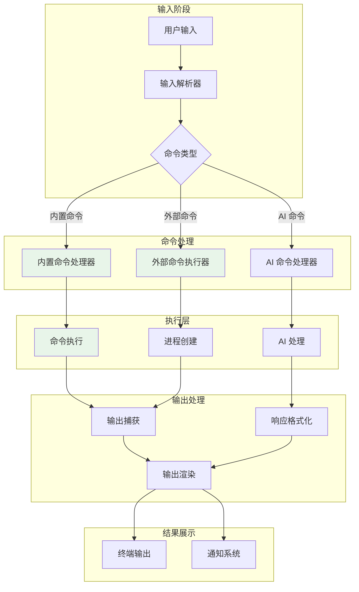
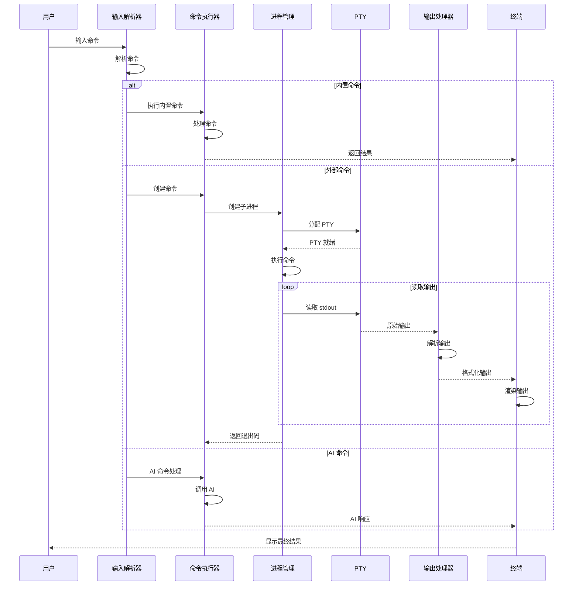

[根目录](../../CLAUDE.md) > [crates](../) > **command**

# command - 命令处理

> 最后更新：2026年 5月 1日 星期五 22時40分12秒 CST

## 模块职责

`command` crate 提供了与进程交互的接口，确保命令使用正确的参数集生成。这是 Windows 平台特别需要的：任何尝试在没有 `no_window` 标志的情况下生成新命令都会导致新终端在应用程序前面闪烁。

## 架构和流程

### 命令执行流程

完整的命令执行流程架构图和序列图请参考：[`.claude/architecture-diagrams.md`](../../.claude/architecture-diagrams.md#4-命令执行流程)

**流程概览**：
1. 用户输入被解析器识别命令类型
2. 根据类型分发到不同的处理器（内置/外部/AI）
3. 执行命令并捕获输出
4. 格式化并渲染结果

### 架构图



### 序列图



## 入口与启动

### 主要入口

- **`src/lib.rs`** - 库入口
  - 导出 `blocking::Command`（`std::process::Command` 的替代品）
  - 导出 `r#async::Command`（`async_process::Command` 的替代品）
  - 平台特定实现（`unix`、`windows`）

## 对外接口

### 核心接口

1. **`blocking::Command`** - 同步命令执行
   - 可作为 `std::process::Command` 的直接替代品
   - 确保进程在 Windows 上无窗口生成

2. **`r#async::Command`** - 异步命令执行
   - 可作为 `async_process::Command` 的直接替代品
   - 异步进程管理和 I/O

3. **平台特定实现**
   - **`unix`** - Unix/Linux/macOS 特定实现
   - **`windows`** - Windows 特定实现

### 导出类型

```rust
pub use std::process::{
    ExitStatus,  // 进程退出状态
    Output,      // 进程输出（stdout + stderr）
    Stdio,       // 标准I/O配置
};
```

## 关键依赖与配置

### 依赖项

**通用依赖**:
- 无外部依赖（仅使用标准库）

**Unix 特定依赖** (`cfg(unix)`):
- **`libc`** - C 标准库接口
  - 提供 Unix 系统调用和类型

**Windows 特定依赖** (`cfg(windows)`):
- **`anyhow`** - 错误处理
- **`lazy_static`** - 静态变量初始化
- **`log`** - 日志记录
- **`thiserror`** - 错误派生宏
- **`win32job`** (2.0.2) - Windows 作业对象
- **`windows`** - Windows API 绑定

**非 WASM 目标依赖** (`cfg(not(target_family = "wasm"))`):
- **`async-process`** - 异步进程管理
- **`futures-lite`** - 轻量级 futures

### 特性标志

- **`test-util`** - 测试工具支持

## 数据模型

### 核心抽象

```rust
// 阻塞命令（类似 std::process::Command）
pub struct Command {
    // 命令配置
    // 确保在 Windows 上使用 no_window 标志
}

// 异步命令（类似 async_process::Command）
pub struct Command {
    // 异步命令配置
    // 支持异步 I/O 和进程管理
}
```

### 平台特定行为

**Windows**:
- 所有生成的进程默认使用 `no_window` 标志
- 使用作业对象（Job Objects）进行进程管理
- 防止控制台窗口闪烁

**Unix**:
- 使用标准 Unix 进程生成机制
- 通过 `libc` 调用系统函数

## 测试与质量

### 测试策略

- 使用 `test-util` 特性标志启用测试工具
- 平台特定测试（通过 `cfg` 属性）
- 集成测试验证进程生成行为

### 代码质量

- 遵循 Rust 2021 edition 标准
- 类型安全的进程管理
- 完善的错误处理

## 常见问题 (FAQ)

### Q1: 为什么需要这个 crate？

Windows 平台上的进程生成默认会创建新的控制台窗口，导致用户体验不佳。这个 crate 封装了进程生成逻辑，确保：
1. Windows 上使用 `no_window` 标志
2. 跨平台一致的 API
3. 避免终端窗口闪烁

### Q2: 如何使用 `blocking::Command`？

```rust
use command::blocking::Command;

// 替代 std::process::Command
let output = Command::new("ls")
    .arg("-la")
    .output()
    .expect("failed to execute process");

println!("stdout: {}", String::from_utf8_lossy(&output.stdout));
```

### Q3: 如何使用异步命令执行？

```rust
use command::r#async::Command;

// 替代 async_process::Command
let output = Command::new("sleep")
    .arg("1")
    .output()
    .await
    .expect("failed to execute process");
```

### Q4: 如何处理平台特定代码？

使用 `cfg` 属性：

```rust
#[cfg(windows)]
{
    use command::windows::WindowsSpecific;
    // Windows 特定代码
}

#[cfg(unix)]
{
    use command::unix::UnixSpecific;
    // Unix 特定代码
}
```

## 相关文件清单

### 核心文件

- `Cargo.toml` - 包配置
- `src/lib.rs` - 库入口
- `src/blocking.rs` - 同步命令实现
- `src/async.rs` - 异步命令实现

### 平台特定文件

- `src/unix.rs` - Unix/Linux/macOS 实现
- `src/windows.rs` - Windows 实现

### 构建配置

- `build.rs` - 构建脚本（如果存在）

## 架构说明

### 设计目标

1. **跨平台一致性** - 提供统一的 API，隐藏平台差异
2. **Windows 用户体验** - 防止控制台窗口闪烁
3. **异步支持** - 支持现代异步 Rust 生态系统
4. **零成本抽象** - 最小化性能开销

### 实现策略

- **包装器模式** - 包装标准库和常用库的类型
- **编译时平台选择** - 使用 `cfg` 属性
- **类型安全** - 利用 Rust 类型系统确保正确性

## 变更记录

### 2026-05-01 (22:40)

- ✅ 初始化模块文档
- ✅ 记录核心接口和平台特定行为
- ✅ 添加使用示例
- ✅ 记录依赖和配置
- ✅ 添加常见问题解答

---

*本文档由 AI 自动生成和维护。如有问题或建议，请在 issue 中提出。*
