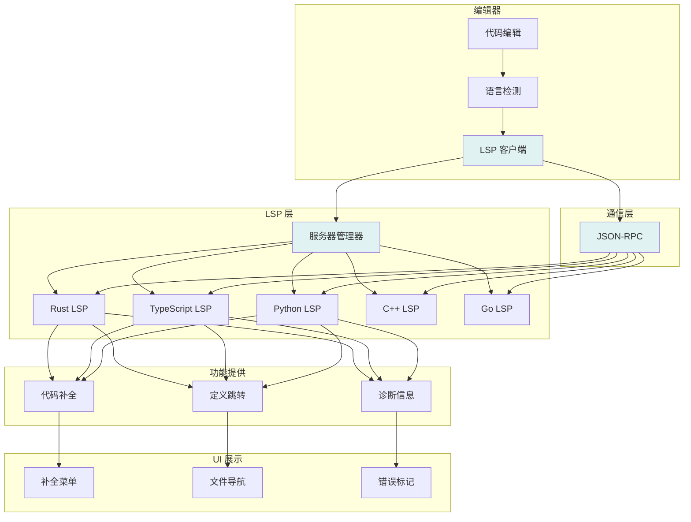
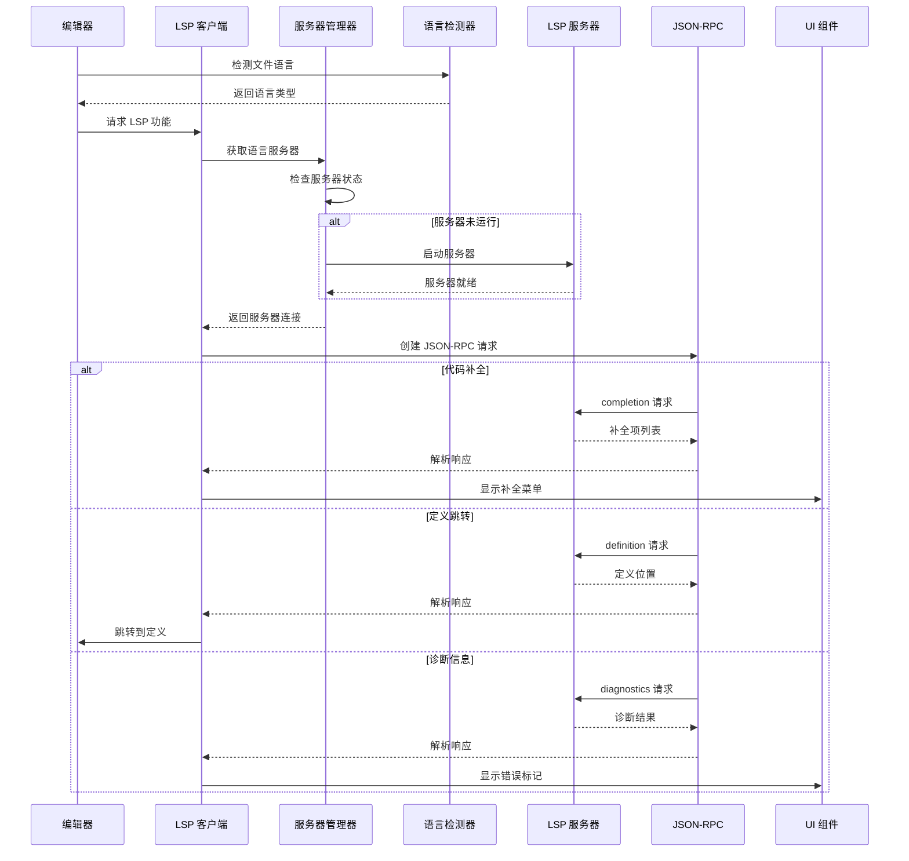

[根目录](../../CLAUDE.md) > **crates/lsp**

# LSP 模块

> 最后更新：2026年 5月 1日

## 模块职责

LSP 模块提供 Language Server Protocol (LSP) 实现，使 Warp 能够与各种语言服务器集成，为用户提供代码补全、跳转到定义、查找引用、诊断信息等 IDE 功能。

**核心功能**：
- LSP 服务器生命周期管理（启动、停止、通信）
- 多语言服务器支持（Rust、TypeScript、Python、C++、Go）
- 工作区检测和服务器自动配置
- 诊断信息显示和代码导航
- 跨平台支持（macOS、Windows、Linux、WASM）

## 架构和流程

### LSP 集成流程

完整的 LSP 集成流程架构图和序列图请参考：[`.claude/architecture-diagrams.md`](../../.claude/architecture-diagrams.md#6-lsp-集成流程)

**流程概览**：
1. 编辑器检测文件语言
2. LSP 客户端请求对应语言服务器
3. 服务器管理器检查并启动服务器
4. 通过 JSON-RPC 发送请求
5. 处理响应并显示结果

### 架构图



### 序列图



## 入口与启动

### 主要入口点

- `src/lib.rs` - 库入口，导出公共 API
- `src/manager.rs` - `LspManagerModel` - 管理多个 LSP 服务器实例
- `src/model.rs` - `LspServerModel` - 单个 LSP 服务器的模型
- `src/service.rs` - `LspService` - LSP 通信服务

### 初始化流程

1. **检测工作区**：扫描文件系统，检测编程语言和项目配置
2. **选择服务器**：根据语言选择合适的 LSP 服务器
3. **启动服务器**：使用 `spawn_lsp_service()` 启动 LSP 进程
4. **建立通信**：通过 JSON-RPC 或 STDIN/STDOUT 与服务器通信
5. **初始化参数**：发送 `initialize` 请求，传递工作区配置

```rust
// 创建 LSP 服务
let result = spawn_lsp_service(
    config,
    executor,
    logger,
).await?;

let service = result.service;
let channel = result.channel;
```

## 对外接口

### 核心 API

**LspManagerModel** - 管理多个 LSP 服务器：
```rust
pub struct LspManagerModel {
    servers: HashMap<PathBuf, Vec<ModelHandle<LspServerModel>>>,
    external_file_servers: HashMap<PathBuf, LanguageServerId>,
}

impl LspManagerModel {
    pub fn new() -> Self;
    pub fn workspace_roots(&self) -> impl Iterator<Item = &PathBuf>;
    pub fn servers_for_workspace(&self, path: &Path) -> Option<&Vec<ModelHandle<LspServerModel>>>;
}
```

**LspServerModel** - 单个 LSP 服务器的抽象：
```rust
pub struct LspServerModel {
    // 管理单个 LSP 服务器的状态和通信
}
```

**LspService** - LSP 通信服务：
```rust
pub struct LspService {
    // 提供 JSON-RPC 通信接口
}
```

### 支持的语言服务器

位于 `src/servers/`：
- **Rust** - `rust.rs` - rust-analyzer
- **TypeScript** - `typescript_language_server.rs` - TypeScript Language Server
- **Python** - `pyright.rs` - Pyright
- **C++** - `clangd.rs` - clangd
- **Go** - `go.rs` - gopls

### LSP 事件

```rust
pub enum LspEvent {
    // 诊断信息更新
    PublishDiagnostics(PublishDiagnosticsParams),
    // 其他 LSP 通知...
}
```

## 关键依赖与配置

### 依赖

- `lsp-types` - LSP 类型定义 (0.97.0)
- `jsonrpc` - JSON-RPC 实现（内部 crate）
- `async-channel` - 异步通道通信
- `tokio` - 异步运行时（仅非 WASM）
- `async-process` - 进程管理（仅非 WASM）
- `command` - 命令执行（内部 crate）
- `node_runtime` - Node.js 运行时集成

### 配置

**LspServerConfig** - 服务器配置：
```rust
pub struct LspServerConfig {
    pub server_type: LSPServerType,
    pub workspace_root: PathBuf,
    pub command: Command,
    pub initialization_options: Option<serde_json::Value>,
}
```

**特性标志**：
- `local_fs` - 本地文件系统支持

### 环境要求

- 非 WASM 平台需要支持进程 spawning
- WASM 平台使用 `server_repo_watcher_wasm.rs`
- 部分语言服务器需要特定的运行时环境（如 Node.js）

## 数据模型

### 核心类型

```rust
pub type LanguageServerId = usize;

pub enum LSPServerType {
    RustAnalyzer,
    TypeScriptLanguageServer,
    Pyright,
    Clangd,
    Gopls,
}

pub struct LanguageServerCandidate {
    pub server_type: LSPServerType,
    pub workspace_root: PathBuf,
    pub config: LspServerConfig,
}
```

### 诊断信息

```rust
pub struct DocumentDiagnostics {
    pub uri: String,
    pub diagnostics: Vec<lsp_types::Diagnostic>,
}
```

### 传输层

```rust
#[cfg(not(target_arch = "wasm32"))]
pub struct ProcessTransport {
    // 管理 LSP 服务器的进程和 I/O
}
```

## 测试与质量

### 测试覆盖

- **单元测试**：有限（部分模块有 `*_tests.rs` 文件）
- **集成测试**：主要通过 `crates/integration/` 进行
- **手动测试**：需要实际运行 LSP 服务器验证

### 测试文件

- `src/config_tests.rs` - 配置相关测试
- 示例代码：`examples/rust-lsp/main.rs`

### 已知问题

- WASM 平台功能受限（无进程 spawning）
- 某些语言服务器的诊断信息可能不完整
- 跨平台路径处理需要特别注意

## 常见问题 (FAQ)

**Q: 如何添加对新语言服务器的支持？**
A: 在 `src/servers/` 中创建新模块，实现 `LanguageServerCandidate`，并在 `supported_servers.rs` 中注册。

**Q: LSP 服务器启动失败怎么办？**
A: 检查服务器是否安装、路径是否正确、初始化参数是否匹配。查看日志获取详细错误信息。

**Q: WASM 平台如何使用 LSP？**
A: WASM 平台无法直接启动进程，需要通过 `server_repo_watcher_wasm.rs` 与远程服务器通信。

**Q: 如何调试 LSP 通信？**
A: 使用 `logger` 参数启用日志记录，所有 JSON-RPC 消息将被记录。

**Q: 多个工作区如何管理？**
A: `LspManagerModel` 为每个工作区根目录维护独立的服务器列表。

## 相关文件清单

### 核心文件

- `src/lib.rs` - 库入口
- `src/manager.rs` - LSP 服务器管理器
- `src/model.rs` - LSP 服务器模型
- `src/service.rs` - LSP 通信服务
- `src/config.rs` - 配置和初始化参数
- `src/transport.rs` - 传输层实现（非 WASM）

### 语言服务器

- `src/servers/mod.rs` - 服务器模块入口
- `src/servers/rust.rs` - Rust 支持
- `src/servers/typescript_language_server.rs` - TypeScript 支持
- `src/servers/pyright.rs` - Python 支持
- `src/servers/clangd.rs` - C++ 支持
- `src/servers/go.rs` - Go 支持

### 支持文件

- `src/supported_servers.rs` - 支持的服务器列表
- `src/language_server_candidate.rs` - 服务器候选检测
- `src/install.rs` - 服务器安装逻辑
- `src/command_builder.rs` - 命令构建
- `src/types.rs` - 自定义类型定义
- `src/server_repo_watcher.rs` - 仓库监视器（非 WASM）
- `src/server_repo_watcher_wasm.rs` - 仓库监视器（WASM）
- `build.rs` - 构建脚本

### 测试文件

- `src/config_tests.rs`
- `examples/rust-lsp/main.rs`

### 配置文件

- `Cargo.toml` - 依赖和特性配置

## 变更记录

### 2026-05-01

- ✅ 初始化 LSP 模块文档
- ✅ 记录核心 API 和数据模型
- ✅ 记录支持的语言服务器
- ✅ 添加平台特定说明

---

*本文档由 AI 自动生成和维护。如有问题或建议，请在 issue 中提出。*
