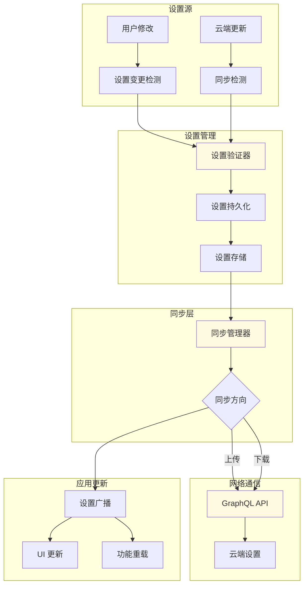
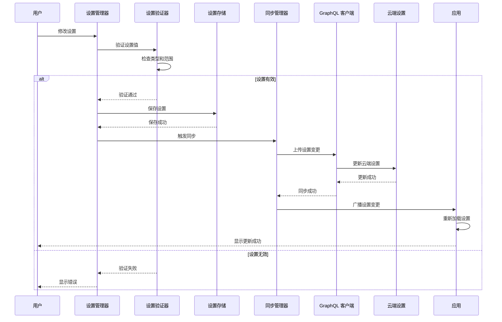

[根目录](../../CLAUDE.md) > **crates/settings**

# Settings 模块

> 最后更新：2026年 5月 1日

## 模块职责

Settings 模块负责 Warp 的设置和配置管理，提供：

- **设置定义**：类型安全的设置定义
- **设置存储**：持久化设置存储
- **设置验证**：设置值验证
- **设置同步**：跨设备设置同步
- **默认值**：设置默认值管理
- **UI 绑定**：与 UI 框架的集成

## 架构和流程

### 设置同步流程

完整的设置同步流程架构图和序列图请参考：[`.claude/architecture-diagrams.md`](../../.claude/architecture-diagrams.md#5-设置同步流程)

**流程概览**：
1. 用户修改设置或云端更新
2. 设置验证器验证新值
3. 持久化到本地存储
4. 通过同步管理器同步到云端
5. 广播设置变更到应用各部分

### 架构图



### 序列图



## 入口与启动

### 主要入口点

- `src/lib.rs` - 库入口
- `src/settings.rs` - 设置定义
- `src/user_preferences.rs` - 用户偏好

### 初始化流程

1. 加载默认设置
2. 读取用户配置
3. 合并设置值
4. 验证设置有效性
5. 应用设置

## 对外接口

### 设置 API

**设置定义**：
```rust
#[derive(Settings, Serialize, Deserialize)]
pub struct Settings {
    pub theme: Theme,
    pub font_size: u32,
    pub tab_size: u32,
    pub key_bindings: KeyBindings,
}
```

**设置管理**：
```rust
pub struct SettingsManager {
    // 设置存储
}

impl SettingsManager {
    pub fn new() -> Self;
    pub fn load(&mut self) -> Result<Settings>;
    pub fn save(&self, settings: &Settings) -> Result<()>;
    pub fn update<F>(&mut self, f: F) -> Result<()>
    where F: FnOnce(&mut Settings);
}
```

### 设置值 API

**设置值**：
```rust
pub trait SettingValue: Clone + Serialize + Deserialize {
    fn default() -> Self;
    fn validate(&self) -> Result<()>;
}
```

**设置键**：
```rust
pub struct SettingKey<T: SettingValue> {
    pub name: String,
    pub default: T,
    pub current: T,
}
```

## 关键依赖与配置

### 依赖

- `settings_value` - 设置值框架
- `warpui` - UI 框架集成
- `warpui_extras` - UI 扩展
- `serde` - 序列化
- `schemars` - JSON Schema 生成

### 特性标志

- `integration_tests` - 集成测试

### 配置文件

**用户设置位置**：
- macOS: `~/Library/Application Support/Warp/settings.json`
- Linux: `~/.config/Warp/settings.json`
- Windows: `%APPDATA%\Warp\settings.json`

## 数据模型

### 设置结构

```rust
#[derive(Settings, Serialize, Deserialize)]
pub struct Settings {
    // 外观
    pub appearance: AppearanceSettings,

    // 编辑器
    pub editor: EditorSettings,

    // 终端
    pub terminal: TerminalSettings,

    // AI
    pub ai: AISettings,

    // 键绑定
    pub key_bindings: KeyBindingsSettings,
}
```

### 外观设置

```rust
#[derive(Settings, Serialize, Deserialize)]
pub struct AppearanceSettings {
    pub theme: Theme,
    pub font_family: String,
    pub font_size: u32,
    pub line_height: f64,
}
```

### 编辑器设置

```rust
#[derive(Settings, Serialize, Deserialize)]
pub struct EditorSettings {
    pub tab_size: u32,
    pub insert_spaces: bool,
    pub word_wrap: bool,
    pub show_line_numbers: bool,
}
```

### 终端设置

```rust
#[derive(Settings, Serialize, Deserialize)]
pub struct TerminalSettings {
    pub shell: String,
    pub shell_args: Vec<String>,
    pub env: HashMap<String, String>,
    pub scrollback_size: usize,
}
```

## 测试与质量

### 单元测试

测试文件位置：
- `src/*_tests.rs`
- `src/*/mod_test.rs`

运行测试：
```bash
cargo nextest run -p settings
```

### 测试覆盖

当前测试覆盖：
- ✅ 设置加载和保存
- ✅ 设置验证
- ✅ 默认值
- ✅ 设置合并
- ⚠️ 跨平台设置路径
- ⚠️ 设置迁移
- ⚠️ 并发访问

## 常见问题 (FAQ)

### Q: 如何添加新的设置？

A:
1. 在设置结构中添加字段
2. 实现默认值
3. 添加验证逻辑
4. 更新 UI

### Q: 设置如何持久化？

A: 设置以 JSON 格式存储在用户配置目录：
```rust
pub fn save_settings(settings: &Settings) -> Result<()> {
    let path = get_settings_path()?;
    let json = serde_json::to_string_pretty(settings)?;
    std::fs::write(path, json)?;
    Ok(())
}
```

### Q: 如何处理设置迁移？

A: 使用版本控制：
```rust
#[derive(Serialize, Deserialize)]
pub struct Settings {
    pub version: u32,
    // 其他设置
}

impl Settings {
    pub fn migrate(&mut self) {
        // 迁移逻辑
    }
}
```

### Q: 如何实现设置同步？

A: 通过云同步服务：
```rust
pub async fn sync_settings(&self) -> Result<()> {
    // 上传到云端
    // 从云端下载
    // 合并设置
}
```

## 相关文件清单

### 核心文件

- `src/lib.rs` - 库入口
- `src/settings.rs` - 设置定义
- `src/user_preferences.rs` - 用户偏好

### UI 集成

- `src/ui/` - UI 组件

### 测试

- `src/*_tests.rs` - 单元测试

## UI 集成

### 设置视图

```rust
pub struct SettingsView {
    pub settings: Settings,
}

impl SettingsView {
    pub fn render(&self, cx: &mut ViewContext) -> View {
        // 渲染设置 UI
    }
}
```

### 设置编辑器

```rust
pub fn render_setting_editor<T: SettingValue>(
    cx: &mut ViewContext,
    key: SettingKey<T>,
) -> View {
    // 渲染设置编辑器
}
```

## 最佳实践

### 设置设计

1. **类型安全**：使用强类型设置
2. **验证**：验证所有设置值
3. **默认值**：提供合理的默认值
4. **文档**：为每个设置提供文档

### 设置存储

1. **原子写入**：避免损坏设置文件
2. **备份**：保留设置备份
3. **版本控制**：支持设置迁移
4. **错误处理**：优雅处理错误

### 性能考虑

1. **延迟加载**：按需加载设置
2. **缓存**：缓存设置值
3. **批量更新**：批量更新设置
4. **变更通知**：通知设置变更

## 变更记录

### 2026-05-01

- 初始化 Settings 模块文档
- 记录核心功能和 API
- 添加最佳实践
