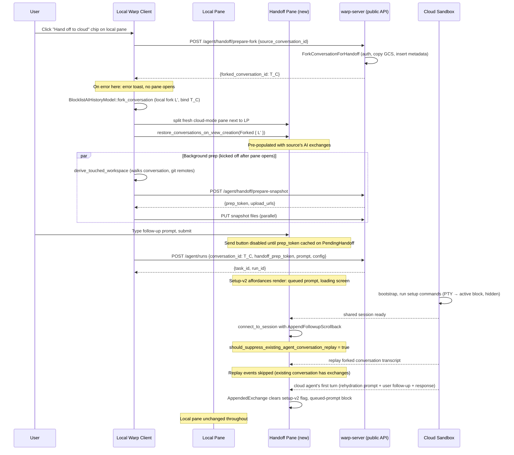

# Local-to-Cloud Handoff: UI Polish — Tech Spec
Product spec: `specs/REMOTE-1519/PRODUCT.md`
Linear: [REMOTE-1519](https://linear.app/warpdotdev/issue/REMOTE-1519/make-ui-better-for-local-cloud-handoff)
## Context
REMOTE-1486 shipped the V0 local-to-cloud handoff: a chip in the agent input footer (or `/oz-cloud-handoff`) opens a fresh cloud-mode pane next to the local pane, the user types a follow-up prompt, and on submit the client snapshots the workspace and spawns a cloud agent that's forked from the local conversation.
That V0 has two rough edges this spec addresses:
1. **No hydration of the source conversation in the new pane.** The fork is materialized server-side at submit time only (`enqueueAgentRun` in `../warp-server-2/router/handlers/public_api/agent_webhooks.go:376-386` calls `ForkConversationForHandoff` and points `task.AgentConversationID` at the fork). Until the cloud agent's shared session connects and replays the conversation transcript, the new pane is blank. The cloud session's replay then re-broadcasts every exchange the user already saw in the local pane.
2. **Setup-v2 affordances are not consistent with fresh cloud-mode runs.** A fresh cloud-mode pane uses `BlockList::set_is_executing_oz_environment_startup_commands(true)` (set in `app/src/terminal/model/terminal_model.rs:1238-1241`), which hides the active block, marks it as a setup command, and renders a "Running setup commands…" collapsible row above it (`CloudModeSetupTextBlock` in `app/src/terminal/view/ambient_agent/block/setup_command_text.rs`). The flag is reset on the first `AppendedExchange` (`app/src/terminal/view.rs:5113-5124`). For handoff panes the pre-populated conversation's exchanges trip that reset path early (when we restore them via `restore_conversations_on_view_creation`), unhiding the active block before the cloud session has even connected — so when the cloud agent's environment startup PTY output arrives it renders raw rather than wrapped in the setup-v2 surface.
The pieces this spec builds on:
- **Cloud-cloud handoff replay suppression.** When `attach_followup_session` joins a fresh shared session for a follow-up cloud execution, it uses `SharedSessionInitialLoadMode::AppendFollowupScrollback` (`app/src/terminal/shared_session/viewer/terminal_manager.rs:340-370`), which (a) deduplicates blocks by ID via `BlockList::append_followup_shared_session_scrollback` (`app/src/terminal/model/blocks.rs:725`) and (b) sets `should_suppress_existing_agent_conversation_replay = true` (`app/src/terminal/shared_session/viewer/event_loop.rs:132-134`). When the cloud agent's replay arrives, `BlocklistAIController::should_skip_replayed_response_for_existing_conversation` (`app/src/ai/blocklist/controller/shared_session.rs:220-239`) skips response streams whose conversation already has exchanges in our local history. We will reuse this exact mechanism for the local→cloud first-session connect.
- **Fork-into-new-pane restoration.** `BlocklistAIHistoryModel::fork_conversation` (`app/src/ai/blocklist/history_model.rs:1033`) materializes a forked `AIConversation` locally from a source conversation. `ConversationRestorationInNewPaneType::Forked { conversation }` (`app/src/terminal/view/load_ai_conversation.rs:104-106`) feeds it into a freshly-created pane via `restore_conversations_on_view_creation`, which restores AI blocks for every exchange with live (non-restored) appearance.
- **Server-side fork and conversation-token binding.** `ForkConversationForHandoff` in `../warp-server-2/logic/ai_conversation_fork.go` already implements the server fork end-to-end (auth on source, GCS data copy, metadata insert, `has_gcs_data = TRUE`); it's currently called only from `enqueueAgentRun`. The viewer-side `BlocklistAIController::find_existing_conversation_by_server_token` (`app/src/ai/blocklist/controller/shared_session.rs:418-433`) maps a `StreamInit.conversation_id` to a local `AIConversation` by token; if we set the local fork's `server_conversation_token` to the server fork's id at chip-click time, this lookup wires them up automatically when the cloud session arrives.
- **REMOTE-1486 client surface area.** `Workspace::start_local_to_cloud_handoff` (`app/src/workspace/view.rs:12952-13079`) is the entry point invoked by the chip and slash command. It splits a fresh cloud-mode pane via `pane_group.add_ambient_agent_pane(ctx)`, seeds `PendingHandoff` onto the new pane's `AmbientAgentViewModel`, and kicks off async touched-repo derivation. `AmbientAgentViewModel::submit_handoff` (`app/src/terminal/view/ambient_agent/model.rs:1108-1177`) runs the snapshot prep + upload orchestrator and then calls `spawn_agent_with_request` with `fork_from_conversation_id` set on the `SpawnAgentRequest`.
The Linear ticket description ("we should fork the conversation into the cloud pane and re-use the cloud mode loading v2 for the setup commands") covers both pieces; this spec wires them together because the fork-timing change is what enables the setup-v2 fix.
## Diagram

## Proposed changes
### 1. Server-side: split fork from spawn (`../warp-server-2`)
**Why split fork from spawn?** This whole spec hinges on pre-populating the new cloud pane with the source conversation at chip click. That requires a stable, materialized fork at chip-click time, not at submit time, for two reasons:
1. **Stable target.** Once the cloud pane is hydrated we don't want to keep re-syncing it as the user continues typing in the local pane — that would be O(local-conversation-edits) GCS writes for nothing, and would have to merge against whatever the cloud agent is doing in parallel. Forking on click freezes the cloud's view at the moment the user opted into the handoff and lets the two conversations evolve independently.
2. **Semantic match.** Handoff is fork→cloud per the product model: clicking the chip is the user saying "this conversation, as it stands right now, is what I'm sending to the cloud." Forking at submit-time is an implementation accident inherited from REMOTE-1486 V0 (which had no hydration so it didn't matter when the fork happened); forking at click-time mirrors the user's mental model exactly.
The fork currently happens inside `enqueueAgentRun` when `ForkFromConversationID` is set on the `RunAgentRequest` (`router/handlers/public_api/agent_webhooks.go:376-386`). This spec moves the fork to a new dedicated endpoint so the client can mint the fork at chip-click time and pre-populate the pane.
**New endpoint** `POST /api/v1/agent/handoff/prepare-fork`:
```go path=null start=null
type PrepareLocalHandoffForkRequest struct {
    SourceConversationID string `json:"source_conversation_id" binding:"required"`
}
type PrepareLocalHandoffForkResponse struct {
    ForkedConversationID string `json:"forked_conversation_id"`
}
```
Add the handler alongside `PrepareLocalHandoffSnapshotHandler` in `router/handlers/public_api/agent_handoff.go`. It is a thin wrapper that:
1. Gates on `features.LocalToCloudHandoffEnabled()`.
2. Resolves `principal` via `middleware.GetRequiredPrincipalFromContext`.
3. Calls the existing `logic.ForkConversationForHandoff(ctx, db, datastores, req.SourceConversationID, principal)` and returns `{forked_conversation_id}`.
Wire the route under the same `aiCheckedGroup` as the existing snapshot prep endpoint at `router/handlers/public_api/agent_webhooks.go:205-207`.
**Remove `ForkFromConversationID` from `RunAgentRequest`.** Per user direction, no backwards compatibility is needed — the field is only used by the under-flag REMOTE-1486 branch which isn't merged. Delete the field declaration (`agent_webhooks.go:235-240`), the validation block (`agent_webhooks.go:337-344`), and the inline fork call (`agent_webhooks.go:376-386`). The existing `ConversationID *string` field at `agent_webhooks.go:222` continues to drive `task.AgentConversationID` (resume semantics) and is what the client now uses to point the new task at the pre-minted fork.
**`HandoffPrepToken` stays.** Snapshot prep + upload still flow through the existing `prepare-snapshot` endpoint and the same `attachHandoffSnapshotToTask` post-task-creation step; the only thing that moves is when the client triggers them (now async on chip click instead of submit time — see §3). The server handler block at `agent_webhooks.go:476-484` is unchanged.
### 2. Client-side API surface (`app/src/server/server_api/ai.rs`)
- Add `prepare_handoff_fork` to the `AIClient` trait:
```rust path=null start=null
async fn prepare_handoff_fork(
    &self,
    request: PrepareHandoffForkRequest,
) -> Result<PrepareHandoffForkResponse, anyhow::Error>;
```
implemented in `ServerApi` as `POST agent/handoff/prepare-fork`. Mirror the request/response shape pattern of `PrepareHandoffSnapshotRequest` (currently around line 221-249).
- On `SpawnAgentRequest`, **remove** the `fork_from_conversation_id: Option<String>` field (currently line 213) and **add** `conversation_id: Option<String>` for resume semantics. The client now always pre-mints the fork via the new endpoint and sends the resulting id under `conversation_id`.
- Update the snapshot pipeline call site that takes a `&ServerConversationToken` only for log labelling (`upload_snapshot_for_handoff` in `app/src/ai/agent_sdk/driver/snapshot.rs`) — no signature change needed; the source conversation token is still available on the `PendingHandoff`.
### 3. Client-side fork-on-chip-click (`app/src/workspace/view.rs`)
Extend `Workspace::start_local_to_cloud_handoff` (currently at `app/src/workspace/view.rs:12952-13079`) into a strict-ordering open path:
1. **Resolve eligibility synchronously.** Read the active session view's conversation via `BlocklistAIHistoryModel::active_conversation`. If the conversation is missing, empty, or has no `server_conversation_token`, surface the same error toast as the prepare-fork RPC failure path (step 2 below) and return without opening any pane. There is no "fresh cloud-mode pane" fall-through — the chip is a hand-off-this-conversation action, and silently opening an unrelated fresh pane would hide the failure from the user.
2. **Await the fork before opening the pane.** When the source resolves, `ctx.spawn` a future that calls `AIClient::prepare_handoff_fork({source_conversation_id: T_L})`. The new pane is **not** split until this returns. `start_local_to_cloud_handoff` itself returns to the caller immediately so the click handler doesn't block, but the pane-open work is gated on the RPC.
    - **On error** (network, auth, `SourceConversationNotPersisted`, etc.), surface a `WorkspaceToastStack` error toast (mirroring the pattern used by `Self::show_fork_toast` at `app/src/workspace/view.rs:11586-11588` for failed local forks). Log the underlying error. Do **not** open a pane.
    - **On success**, on the main thread, run the rest of the open path described below.
3. **Open and pre-populate the pane.** With `T_C` in hand:
    - Call `pane_group.add_ambient_agent_pane(ctx)` to split the new pane next to the active pane (today's call site).
    - Call `BlocklistAIHistoryModel::fork_conversation(&source_conversation, FORK_PREFIX, app)` to materialize a local fork `L'`. `fork_conversation` already handles SQLite persistence, the `forked_from_server_conversation_token` field, and reverted-action-id preservation.
    - Set `L'.server_conversation_token = T_C` via `BlocklistAIHistoryModel::set_server_conversation_token_for_conversation` (existing helper used by the `link_forked_conversation_token` path). This makes `find_existing_conversation_by_server_token(T_C)` immediately return `L'` once the cloud session connects.
    - On the new pane's terminal view, call `terminal_view.restore_conversation_after_view_creation(RestoredAIConversation::new(L'.clone()), /* use_live_appearance */ true, ctx)` (existing helper at `app/src/terminal/view/load_ai_conversation.rs:542-603`). This is the same restoration helper used by the in-current-pane fork path at `app/src/workspace/view.rs:11597-11607`.
    - Set the new pane's `BlocklistAIContextModel` pending-query state for the forked conversation so the agent view's selected conversation matches `L'` (mirrors `restore_conversations_from_block_params` at `app/src/terminal/view/load_ai_conversation.rs:482-491`).
    - Seed `PendingHandoff` on the new pane's `AmbientAgentViewModel` with `source_conversation_id: T_L`, `forked_conversation_id: T_C`, `touched_workspace: None`, `snapshot_prep_token: None`, `submission_state: Idle`.
    - Apply the slash-command-supplied prompt pre-fill if any.
4. **Kick off async background prep.** After the pane is open, `ctx.spawn` a single chained future on the new pane's `AmbientAgentViewModel` that runs `derive_touched_workspace` → `upload_snapshot_for_handoff` (existing helpers in `app/src/ai/blocklist/handoff/touched_repos.rs` and `app/src/ai/agent_sdk/driver/snapshot.rs`). When derivation completes, call `set_pending_handoff_workspace` so the env-overlap pick can apply (existing behavior). When the upload completes, store the resulting prep token via a new `set_pending_handoff_snapshot_prep_token(Option<String>, ctx)` setter on the model. The pane is fully interactive throughout — the user can type, scroll, and pick an env while this runs.
The send button's existing gate (`pending_handoff.touched_workspace.is_some()` plus prompt non-empty) is extended to also require `snapshot_prep_token.is_some_or_skipped()` — i.e. the upload is either complete or the touched workspace was empty (the existing `upload_snapshot_for_handoff` returns `Ok(None)` for empty workspaces and that's a valid skip).
### 4. Submit path uses resume semantics (`app/src/terminal/view/ambient_agent/model.rs`)
With the fork and the snapshot upload both completed during the chip-click open path, `AmbientAgentViewModel::submit_handoff` becomes a thin shim over `spawn_agent_with_request`. It reads the cached `forked_conversation_id` and `snapshot_prep_token` directly off `pending_handoff` — no orchestrator runtime needed:
```rust path=null start=null
let handoff = self.pending_handoff.as_ref()?;
let request = SpawnAgentRequest {
    prompt,
    config: Some(self.build_default_spawn_config(ctx)),
    title: None,
    team: None,
    skill: None,
    attachments,
    interactive: None,
    parent_run_id: None,
    runtime_skills: vec![],
    referenced_attachments: vec![],
    conversation_id: Some(handoff.forked_conversation_id.clone()),
    handoff_prep_token: handoff.snapshot_prep_token.clone(),
};
self.spawn_agent_with_request(request, ctx);
```
Delete the existing `app/src/ai/blocklist/handoff/orchestrator.rs` (`run_handoff` + `HandoffPrepared`) — the prep-and-upload phase moves to the chip-click path described in §3, and the orchestrator's only remaining role would be a redundant wrapper around `upload_snapshot_for_handoff`. Inline the call directly there. `submit_handoff` retains its existing double-submit guard via `submission_state`.
### 5. Replay-suppressing initial connect (`app/src/terminal/shared_session/viewer/terminal_manager.rs`)
`TerminalManager::connect_to_session` (`app/src/terminal/shared_session/viewer/terminal_manager.rs:322-338`) currently always uses `SharedSessionInitialLoadMode::ReplaceFromSessionScrollback`. Change it so handoff panes use `AppendFollowupScrollback` instead:
- Plumb a `should_append_followup: bool` flag into `connect_to_session` (or a new `connect_to_session_with_load_mode(session_id, load_mode, ctx)` variant — caller's choice).
- The cloud-mode subscription in `app/src/terminal/view/ambient_agent/mod.rs:88-90` calls `manager.connect_to_session(*session_id, ctx)` on `SessionReady`. Update it to also pass `view_model.is_local_to_cloud_handoff()` (read from the model on the same line). When true, use append mode.
The append mode then handles both pieces of dedup automatically: `BlockList::append_followup_shared_session_scrollback` skips block IDs we already have, and `EventLoop::should_suppress_existing_agent_conversation_replay = true` (`event_loop.rs:132-134`) drives `BlocklistAIController::should_skip_replayed_response_for_existing_conversation` to skip the historical response streams. No changes to the suppression machinery itself.
### 6. Setup-v2 active-block guard during conversation restore (`app/src/terminal/view.rs`)
The flag-reset block at `app/src/terminal/view.rs:5113-5124` flips `is_executing_oz_environment_startup_commands` to `false` whenever an `AppendedExchange` arrives in an ambient agent session. During `restore_conversations_on_view_creation`, every restored exchange emits `AppendedExchange` (via `update_conversation_for_new_request_input` → `BlocklistAIHistoryEvent::AppendedExchange`), which trips this reset before the cloud agent has even started its setup commands.
Gate the reset on the model not being in handoff-pre-spawn state:
```rust path=null start=null
if self.is_ambient_agent_session(ctx)
    && self.model.lock().block_list().is_executing_oz_environment_startup_commands()
    && !self.is_in_handoff_replay_phase(ctx)
{
    // existing reset...
}
```
where `is_in_handoff_replay_phase` returns true when `ambient_agent_view_model.is_local_to_cloud_handoff() && (model.is_in_setup() || model.is_configuring_ambient_agent() || model.is_waiting_for_session())` — i.e. the cloud session has not yet connected and the active block should still be treated as a setup-command surface. After `SessionReady` (and thus once `Status::AgentRunning` is set), the predicate becomes false; the cloud agent's actual `AppendedExchange` (its first response post-rehydration) trips the existing reset path normally.
This is the single behavior fix needed for the setup-v2 affordances to render correctly during handoff. The "Running setup commands…" collapsible row, queued-prompt indicator, and loading screen are all already wired up via existing `CloudModeSetupV2`-gated paths and Just Work once the active block stays hidden through the pre-session window.
### 7. Drop the V2-input opt-out for handoff panes (`app/src/terminal/input/agent.rs`)
REMOTE-1486 added a guard at `app/src/terminal/input/agent.rs:65` so handoff panes don't opt into `CloudModeInputV2`. With the setup-v2 affordances now intentionally enabled for handoff panes (per §6 + the product spec's #9), remove the `&& !ambient_agent_view_model.is_local_to_cloud_handoff()` clause from `Input::is_cloud_mode_input_v2_composing`. Handoff panes go through the same V2 input path as fresh cloud-mode runs.
### 8. Feature-flag posture
No new feature flags. All of the changes are gated on the existing `FeatureFlag::OzHandoff && FeatureFlag::LocalToCloudHandoff` (client) and `features.LocalToCloudHandoffEnabled()` (server) used by REMOTE-1486. The client and server flags continue to roll out together.
## Risks and mitigations
- **Chip-click latency is now gated on the prepare-fork RPC.** Previously the pane opened instantly; now the user sees nothing until the fork resolves. *Mitigation:* the fork is a synchronous metadata + GCS-copy round-trip already used at submit time today; expected latency is similar to other authenticated public-API RPCs (<300ms p50). On error we surface a toast immediately so the user knows what happened.
- **Source conversation not synced to GCS.** `ForkConversationForHandoff` returns `InvalidRequestError.New("source conversation %s has not been fully synced to cloud storage; try again in a moment")` when `BatchDoesConversationDataExist` is false. *Mitigation:* the client surfaces this as the toast described above; the user can wait a moment and click again.
- **Replay suppression skips a genuinely new exchange.** `should_skip_replayed_response_for_existing_conversation` skips response streams during replay if the local conversation already has exchanges. If the cloud agent's first response stream arrives during the replay phase (before `AgentConversationReplayEnded`) it could be suppressed too. *Mitigation:* this is the same posture cloud→cloud uses today (`AppendFollowupScrollback`); the runtime emits `AgentConversationReplayEnded` before the new turn streams in, so the new turn lands in the post-replay window.
- **Snapshot upload still in flight at submit time.** The user types a follow-up faster than `derive_touched_workspace` + `upload_snapshot_for_handoff` complete. *Mitigation:* the send button gate already requires `pending_handoff.touched_workspace.is_some()` (existing); we extend it to also require the snapshot upload to be settled (either succeeded with `Some(prep_token)`, deliberately skipped with `Ok(None)` for empty workspaces, or failed with the existing `report_error!` posture so submit can proceed best-effort).
- **Snapshot upload failure.** Per-blob failures already retry with bounded backoff via `upload_snapshot_for_handoff`. If every blob fails, the existing `report_error!` fires and the prep token is still minted (cloud agent starts with no rehydration content). *Mitigation:* unchanged — same best-effort posture as cloud→cloud handoff today, just kicked off earlier.
## Testing and validation
### Unit tests
- `app/src/server/server_api/ai_test.rs`: serialization test for `PrepareHandoffForkRequest`, path test for `build_prepare_handoff_fork_url`, mirroring the pattern of the existing `serialize_run_followup_request` test.
- `app/src/ai/blocklist/history_model_test.rs`: test that `set_server_conversation_token_for_conversation` after `fork_conversation` updates the token-to-conversation reverse index so `find_conversation_id_by_server_token(T_C)` finds the fork.
- `app/src/terminal/view/view_test.rs`: a minimal regression covering the setup-v2 reset gate — restoring exchanges into a handoff pane while the model is in `Setup`/`Composing`/`WaitingForSession` does NOT flip `is_executing_oz_environment_startup_commands` to false.
- `app/src/terminal/shared_session/viewer/event_loop_test.rs`: extend the existing append-mode tests to cover the local→cloud connect path (i.e. `AppendFollowupScrollback` mode is what `connect_to_session` uses when the model reports `is_local_to_cloud_handoff`).
### Server tests (`../warp-server-2`)
- `router/handlers/public_api/agent_handoff_test.go`: extend the existing test file with a `TestPrepareLocalHandoffForkHandler_*` suite covering: feature-flag-off returns the standard error; missing `source_conversation_id` returns `invalid request payload`; happy path returns a valid UUID; auth failure on the source returns the wrapped `NotAuthorizedError`.
- Update the existing `agent_webhooks_test.go::TestHandoff_*` cases that exercise `ForkFromConversationID`. With the field removed those tests should switch to driving the new `prepare-fork` endpoint and then sending `ConversationID` on the run request, asserting the same end-state (`task.AgentConversationID = <forked_id>`, `snapshots/{task_id}/0/` populated).
### Integration / manual
- Click the chip on a long Oz conversation; verify the new pane is visibly populated with the AI exchanges before the cloud session connects, with no flicker or duplicate blocks during the connect/replay window.
- Submit a follow-up; verify the queued-prompt indicator + "Setting up environment" loading screen + "Running setup commands…" collapsible block all render the same way they do for a fresh cloud-mode run.
- After the cloud agent's first turn arrives, verify the pre-populated blocks remain in place, the queued-prompt indicator clears, and the new exchange appends below them.
- Click the chip on a non-eligible conversation (no synced server token); verify **no pane opens** and an error toast surfaces in the local window. The local conversation should be unaffected.
- Manually break a network connection during chip click so the prepare-fork RPC fails; verify **no pane opens** and an error toast surfaces in the local window. The local conversation should be unaffected and the chip should be re-clickable.
## Parallelization
The two-side change (server endpoint + client wiring) is small enough that one engineer/agent can implement it sequentially in two PRs — a server PR for the prepare-fork endpoint + `ForkFromConversationID` removal, then a client PR for the hydration + load mode + setup-v2 reset gate. The user has indicated they will handle the server-side changes themselves in `../warp-server-2`, so the client agent does not need to coordinate with a parallel server agent. No sub-agents needed for this scope.
## Follow-ups
- Cloud→cloud setup-v2 fixes. Cloud-cloud follow-ups (REMOTE-1290) likely have the same setup-v2 active-block reset issue when the follow-up's environment runs setup commands. Out of scope here, but the gate added in §6 can be generalized to also check for follow-up startups.
